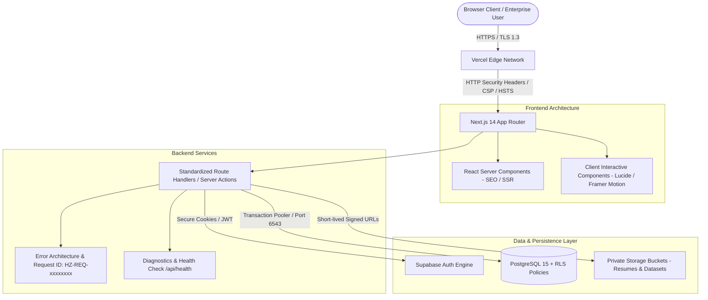

# Hackerzone — System Architecture & Technical Design

> **Platform:** Hackerzone (`hackerzone.in`)  
> **Tagline:** The human intelligence network powering the AI economy.  
> **Mission:** Organize human intelligence to power the AI economy.

---

## 1. Architectural Overview

Hackerzone is a global human intelligence infrastructure platform designed to connect verified human experts with AI companies, enterprises, and research labs for RLHF, domain-specific evaluation, AI agent benchmarking, red teaming, and human-in-the-loop workflows.



---

## 2. Frontend Layer (Presentation & Interaction)

- **Framework:** Next.js 14.2 (App Router with React 18).
- **Styling & Design System:**
  - Strict B&W brutalist/technical aesthetic (`#0A0A0A` background, `#141414` cards, `#262626` borders, `#FAFAFA` text).
  - Typography: Google Fonts Inter (primary body) & Anton (display headers).
  - Tailwind CSS with zero-radius containers (`rounded-none`), monospace metadata badges, and high-contrast micro-interactions.
- **Client vs. Server Rendering:**
  - Public marketing routes (`/`, `/experts`, `/projects`, `/solutions`, `/resources`, `/pricing`) leverage React Server Components for near-instant LCP and optimized Core Web Vitals.
  - Interactive dashboards (`/student/*`, `/company/*`, `/admin/*`) utilize hydrated Client Components for real-time reactivity, form validation, and autosave workflows.

---

## 3. Backend Layer (Business Logic & Authorization)

- **Execution Model:** Vercel Serverless Functions (Node.js 20+ runtime).
- **Standardized API Contract:**
  - Unified error schema via `lib/errors.ts`:
    ```json
    {
      "success": false,
      "error": {
        "code": "VALIDATION_ERROR",
        "message": "Please check the highlighted fields.",
        "requestId": "HZ-REQ-XXXXXXXX"
      }
    }
    ```
- **Traceability:** Every request attaches a correlation Request ID (`HZ-REQ-xxxxxxxx`) propagated through response headers (`X-Request-Id`) and error boundaries.
- **Defensive Timeouts & Retries:** External requests enforce strict timeouts to prevent serverless function hangs.

---

## 4. Database Layer (PostgreSQL & Multi-Tenancy)

- **Engine:** PostgreSQL 15 managed via Supabase.
- **Connection Strategy:**
  - Serverless functions connect via Supabase PostgREST client or connection pooler (Session / Transaction mode on port 6543) to prevent connection exhaustion during traffic spikes.
- **Tenant Isolation:**
  - Row Level Security (RLS) is active on every table.
  - Organization resources (`projects`, `tasks`, `evaluations`) require `organization_id` match against authenticated session metadata.
- **Indexing Strategy:**
  - High-traffic columns are indexed: `user_id`, `company_id`, `status`, `created_at`, `skills_required`.

---

## 5. Storage Architecture

- **Private Buckets:** Resumes, confidential evaluation data, and red-teaming artifacts are strictly non-public.
- **Access Control:** File downloads and previews are served via signed URLs generated with 60-minute time-to-live (`TTL: 3600s`).
- **File Validation:** MIME inspection and size limits (max 10MB) enforced before upload confirmation.

---

## 6. Observability & SRE

- **Health Checks:** `/api/health` and `/health` probe environment configuration, database responsiveness, and service availability, outputting structured check metrics without leaking credentials.
- **Error Boundaries:** Route-level (`app/error.tsx`) and root-level (`app/global-error.tsx`) error boundaries guarantee that isolated client component failures cannot crash the whole application.
